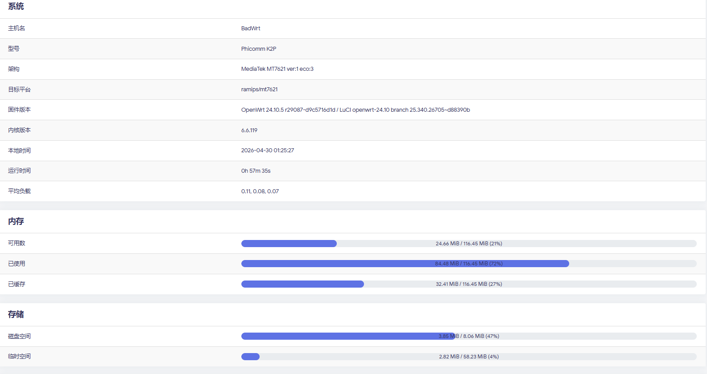
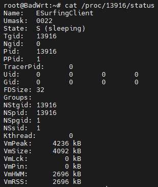

# ESurfingClient-C

**根据 Rsplwe 大蛇的 Kotlin 源码编写的 C 语言版本的 `广东` 天翼校园认证客户端** :+1:

**优点是程序文件超级小(所有版本均是总共占用不超过 3MB 的储存空间😋)，跨平台跨架构能力超强**

> [!NOTE]
> 现在正在做 Web 前端，完成后可以更方便地管理程序

## 附上作者自用 K2P 路由器安装本包之后的资源占用情况⬇

  

# 目前支持的环境

|系统|架构|版本(Linux 内核版本)|
|----|----|----|
|Windows|x86_64|All|
|Linux|x86_64|All|
|OpenWrt|x86_64|21.02.7(5.4.238)|
|OpenWrt|x86_64|22.03.7(5.10.221)|
|OpenWrt|x86_64|24.10.4(6.6.110)|
|OpenWrt|Arm64-MTFilogic|24.10.4(6.6.110)|
|OpenWrt|Mipsel_24kc-MT7621|21.02.7(5.4.238)|
|OpenWrt|Mipsel_24kc-MT7621|23.05.0(5.15.134)|
|OpenWrt|Mipsel_24kc-MT7621|24.10.4(6.6.110)|

> [!TIP]
> 如果有其它兼容需求，可以提交一个 issue ，会尝试进行兼容
> 
> 务必要在 issue 中说明系统和架构
> 
> 如果是 OpenWrt 系统，可以先查看自己系统的内核版本，尝试内核版本相近的 .ipk 包，或将 OpenWrt 系统版本更新到官方稳定版再请求适配
> 
> **不做快照版适配！**
> 
> **不做快照版适配！**
> 
> **不做快照版适配！**

# 使用教程

[**Windows & Linux 环境**](Windows&Linux.md)

[**OpenWRT 环境**](OpenWRT.md)

# 关于日志系统

### 在 Windows 系统中

- 程序运行后，会在程序的运行目录下新建 logs 文件夹

- 程序运行时，logs 目录下会生成实时更新的 run.log 日志文件

- 程序退出时，run.log 日志文件会被重命名为<当前时间>.log

### 在 Linux 类系统中

- 程序运行后，会新建 /var/log/esurfing/logs 目录

- 程序运行时，logs 目录下会生成实时更新的 run.log 日志文件

- 程序退出时，run.log 日志文件会被重命名为<当前时间>.log

- 同时满足 debug 模式开启和 smallDevice 模式关闭的条件的时候程序会将日志存储到 /usr/esurfing 目录中

# [更新日志](UpdateLogs.md)

> [!WARNING]
> 不要让我发现有人拿去做路由器贩卖

# 赞助👍

觉得好的话可以点击这个[神秘小链接](https://afdian.com/a/badghost)或者下边的微信赞赏码给偶打点钱哦，谢谢泥喵

# 赞助者 ❤

**感谢下面的赞助者支持👍**

