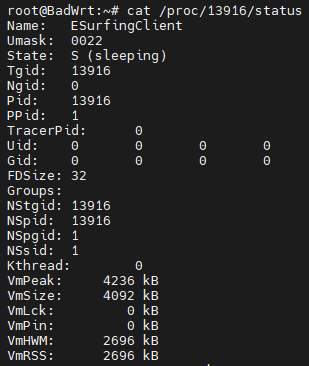
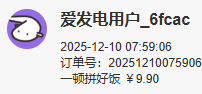

# ESurfingClient-C

**根据 Rsplwe 大佬的 Kotlin 源码编写的纯 C 版本的 `广东` 天翼校园认证客户端** :+1:

**优点是程序文件超级小 (所有版本均是仅占用 2MB 左右的储存空间😋), 并且跨平台跨架构能力超强**

> [!NOTE]
> **(搁置中)** 现在正在做 Web 前端, 完成后可以更方便地管理程序
> 
> 可以在 **[[快照版]](https://github.com/BadGhost520/ESurfingClient-CVersion-Snapshot)** 查看我的更新进度

## 附上作者自用 K2P 路由器安装本包之后的资源占用情况⬇

  

# 目前支持的系统和架构

| 系统      | 架构                 | 包管理器 | 理论最低支持版本            | 最低推荐版本          |
|---------|--------------------|------|---------------------|-----------------|
| Windows | x86_64             | /    | Windows XP SP3      | Windows 10	     |
| Linux   | x86_64             | /    | Linux 内核 2.6.0      | Linux 内核 4.14   |
| OpenWrt | x86_64             | opkg | OpenWrt 15.05       | OpenWrt 18.06.0 |
| OpenWrt | x86_64             | apk  | OpenWrt 25.12.0-rc1 | OpenWrt 25.12.0 |
| OpenWrt | ramips_mt7621      | opkg | OpenWrt 15.05       | OpenWrt 18.06.0 |
| OpenWrt | ramips_mt7621      | apk  | OpenWrt 25.12.0-rc1 | OpenWrt 25.12.0 |
| OpenWrt | qualcommax_ipq60xx | opkg | OpenWrt 15.05       | OpenWrt 18.06.0 |
| OpenWrt | qualcommax_ipq60xx | apk  | OpenWrt 25.12.0-rc1 | OpenWrt 25.12.0 |
| OpenWrt | mediatek_filogic   | opkg | OpenWrt 15.05       | OpenWrt 18.06.0 |
| OpenWrt | mediatek_filogic   | apk  | OpenWrt 25.12.0-rc1 | OpenWrt 25.12.0 |

> [!TIP]
> 如果有其它兼容需求, 可以提交一个 issue, 会尝试进行兼容
> 
> 务必要在 issue 中提供系统和 cpu 型号, 架构等信息

# 使用教程

[**Windows & Linux 环境**](Windows&Linux.md)

[**OpenWRT 环境**](OpenWRT.md)

[**OpenWRT 进阶 - 多播**](OpenWRT_mwan3.md)

# 关于日志系统

### 在 Windows 系统中

- 程序运行后, 会在程序的运行目录下新建 logs 文件夹
- 程序运行时, logs 目录下会生成实时更新的 run.log 日志文件
- 程序退出时, run.log 日志文件会被重命名为<当前时间>.log
- 日志行数超过 10000 行会进行轮转操作 (虽然不大可能会有那么长)

### 在 Linux 系统中 (包括 OpenWRT 系统)

- 程序运行后, 会新建 /var/log/esurfing/logs 目录
- 程序运行时, logs 目录下会生成实时更新的 run.log 日志文件
- 程序退出时, run.log 日志文件会被重命名为<当前时间>.log
- 日志行数超过 10000 行会进行轮转操作 (虽然不大可能会有那么长)

# [更新日志](UpdateLogs.md)

> [!WARNING]
> 不要让我发现有人拿去做路由器贩卖喔

# 赞助 👍

觉得好的话可以点击这个[神秘小链接](https://afdian.com/a/badghost)或者下边的微信赞赏码给偶打点钱哦，谢谢泥喵~

# 赞助者 ❤

**感谢下面的赞助者支持👍**

