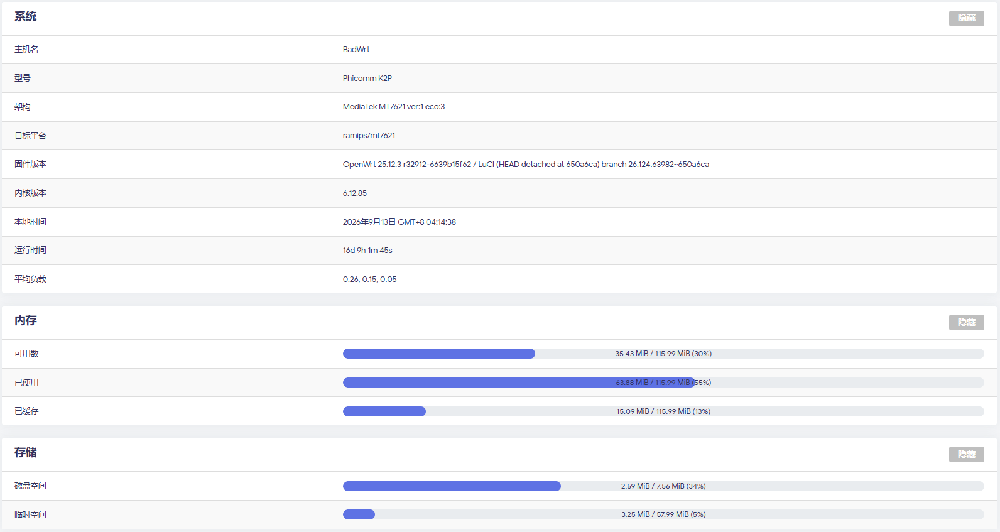
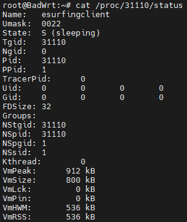

# ESurfingClient-CVersion > [最新版本](https://github.com/BadGhost520/ESurfingClient-CVersion/releases/latest/)

**根据 [Rsplwe](https://github.com/Rsplwe) 佬的 Kotlin 源码编写的纯 C 版本的 `广东` 天翼校园认证客户端** 👍

**使用了 [cJSON](https://github.com/DaveGamble/cJSON), [mongoose](https://github.com/cesanta/mongoose), [curl](https://github.com/curl/curl) 开源库**

**优点是主程序文件超级小 (所有版本均是仅占用 200-300kB 左右的储存空间😋), 并且跨平台跨架构能力超强**

**目前有支持 Windows, Linux, MacOS, OpenWRT 平台**

**安卓平台可前往 [Ironjhin](https://github.com/Ironjhin) 制作的 [EsurfingClient_Android](https://github.com/Ironjhin/EsurfingClient_Android)**

> [!WARNING]
> 程序只负责在不同平台登录校园网
> 
> 不负责包括但不限于无视用户数限制登录等不合规操作
>
> 不要让我发现有人拿去做路由器贩卖喔

> [!NOTE]
> `非广东` 省的地区因为认证流程不同所以不一定可行
>
> 正在努力添加功能并修复 bug
> 
> 目前正在做桌面端的 Web 前端, 完成后可以更方便地管理程序 (仍在鸽子中)

> [!TIP]
> 要是有人能一起维护这个项目, 那将是极好的😋

## 附上作者自用 K2P 路由器安装本包之后的资源占用情况⬇ (图中还安装了 MWAN3 插件)

  

> [!TIP]
> ~~经实测, 运行十天后运行内存占用仅增加 300 kB 左右~~
>
> ~~初运行~~
>
> ~~VmHWM: 2696 kB, VmRSS: 2696 kB~~
>
> ~~十天后~~
>
> ~~VmHWM: 3108 kB, VmRSS: 3048 kB~~
>
> 旧数据, 新数据待测
> 
> 4 级信息级日志文件轮换后占用 100 kB 左右

# [更新日志](UpdateLogs.md)

# 目前支持的系统和架构

主程序插件包

|  系统   |           架构            | 包管理器 |     理论最低支持版本      |        推荐版本         |
|:-------:|:-------------------------:|:--------:|:-------------------------:|:-----------------------:|
| Windows |          x86_64           |    /     |      Windows XP SP3       |       Windows 10	        |
|  Linux  |          x86_64           |    /     |     Linux 内核 2.6.0      |     Linux 内核 4.14     |
|  macOS  |          x86_64           |    /     |         macOS 12          |        macOS 13         |
|  macOS  |          aarch64          |    /     |         macOS 13          |        macOS 14         |
| OpenWrt |    aarch64_cortex-a53     | opkg/apk | OpenWrt 15.05/25.12.0-rc1 | OpenWrt 19.07.0/25.12.0 |
| OpenWrt |    aarch64_cortex-a72     | opkg/apk | OpenWrt 15.05/25.12.0-rc1 | OpenWrt 19.07.0/25.12.0 |
| OpenWrt |    aarch64_cortex-a76     | opkg/apk | OpenWrt 15.05/25.12.0-rc1 | OpenWrt 19.07.0/25.12.0 |
| OpenWrt |      aarch64_generic      | opkg/apk | OpenWrt 15.05/25.12.0-rc1 | OpenWrt 19.07.0/25.12.0 |
| OpenWrt |   arm_arm1176jzf-s_vfp    | opkg/apk | OpenWrt 15.05/25.12.0-rc1 | OpenWrt 19.07.0/25.12.0 |
| OpenWrt |      arm_arm926ej-s       | opkg/apk | OpenWrt 15.05/25.12.0-rc1 | OpenWrt 19.07.0/25.12.0 |
| OpenWrt | arm_cortex-a15_neon-vfpv4 | opkg/apk | OpenWrt 15.05/25.12.0-rc1 | OpenWrt 19.07.0/25.12.0 |
| OpenWrt |    arm_cortex-a5_vfpv4    | opkg/apk | OpenWrt 15.05/25.12.0-rc1 | OpenWrt 19.07.0/25.12.0 |
| OpenWrt |       arm_cortex-a7       | opkg/apk | OpenWrt 15.05/25.12.0-rc1 | OpenWrt 19.07.0/25.12.0 |
| OpenWrt | arm_cortex-a7_neon-vfpv4  | opkg/apk | OpenWrt 15.05/25.12.0-rc1 | OpenWrt 19.07.0/25.12.0 |
| OpenWrt |    arm_cortex-a7_vfpv4    | opkg/apk | OpenWrt 15.05/25.12.0-rc1 | OpenWrt 19.07.0/25.12.0 |
| OpenWrt |    arm_cortex-a8_vfpv3    | opkg/apk | OpenWrt 15.05/25.12.0-rc1 | OpenWrt 19.07.0/25.12.0 |
| OpenWrt |       arm_cortex-a9       | opkg/apk | OpenWrt 15.05/25.12.0-rc1 | OpenWrt 19.07.0/25.12.0 |
| OpenWrt |    arm_cortex-a9_neon     | opkg/apk | OpenWrt 15.05/25.12.0-rc1 | OpenWrt 19.07.0/25.12.0 |
| OpenWrt |  arm_cortex-a9_vfpv3-d16  | opkg/apk | OpenWrt 15.05/25.12.0-rc1 | OpenWrt 19.07.0/25.12.0 |
| OpenWrt |         arm_fa526         | opkg/apk | OpenWrt 15.05/25.12.0-rc1 | OpenWrt 19.07.0/25.12.0 |
| OpenWrt |        arm_xscale         | opkg/apk | OpenWrt 15.05/25.12.0-rc1 | OpenWrt 19.07.0/25.12.0 |
| OpenWrt |       armeb_xscale        | opkg/apk | OpenWrt 15.05/25.12.0-rc1 | OpenWrt 19.07.0/25.12.0 |
| OpenWrt |     i386_pentium-mmx      | opkg/apk | OpenWrt 15.05/25.12.0-rc1 | OpenWrt 19.07.0/25.12.0 |
| OpenWrt |       i386_pentium4       | opkg/apk | OpenWrt 15.05/25.12.0-rc1 | OpenWrt 19.07.0/25.12.0 |
| OpenWrt |    loongarch64_generic    | opkg/apk | OpenWrt 15.05/25.12.0-rc1 | OpenWrt 19.07.0/25.12.0 |
| OpenWrt |      mips64_mips64r2      | opkg/apk | OpenWrt 15.05/25.12.0-rc1 | OpenWrt 19.07.0/25.12.0 |
| OpenWrt |     mips64_octeonplus     | opkg/apk | OpenWrt 15.05/25.12.0-rc1 | OpenWrt 19.07.0/25.12.0 |
| OpenWrt |     mips64el_mips64r2     | opkg/apk | OpenWrt 15.05/25.12.0-rc1 | OpenWrt 19.07.0/25.12.0 |
| OpenWrt |         mips_24kc         | opkg/apk | OpenWrt 15.05/25.12.0-rc1 | OpenWrt 19.07.0/25.12.0 |
| OpenWrt |        mips_mips32        | opkg/apk | OpenWrt 15.05/25.12.0-rc1 | OpenWrt 19.07.0/25.12.0 |
| OpenWrt |        mipsel_24kc        | opkg/apk | OpenWrt 15.05/25.12.0-rc1 | OpenWrt 19.07.0/25.12.0 |
| OpenWrt |     mipsel_24kc_24kf      | opkg/apk | OpenWrt 15.05/25.12.0-rc1 | OpenWrt 19.07.0/25.12.0 |
| OpenWrt |        mipsel_74kc        | opkg/apk | OpenWrt 15.05/25.12.0-rc1 | OpenWrt 19.07.0/25.12.0 |
| OpenWrt |       mipsel_mips32       | opkg/apk | OpenWrt 15.05/25.12.0-rc1 | OpenWrt 19.07.0/25.12.0 |
| OpenWrt |      powerpc64_e5500      | opkg/apk | OpenWrt 15.05/25.12.0-rc1 | OpenWrt 19.07.0/25.12.0 |
| OpenWrt |       powerpc_464fp       | opkg/apk | OpenWrt 15.05/25.12.0-rc1 | OpenWrt 19.07.0/25.12.0 |
| OpenWrt |       powerpc_8548        | opkg/apk | OpenWrt 15.05/25.12.0-rc1 | OpenWrt 19.07.0/25.12.0 |
| OpenWrt |      riscv64_generic      | opkg/apk | OpenWrt 15.05/25.12.0-rc1 | OpenWrt 19.07.0/25.12.0 |
| OpenWrt |          x86_64           | opkg/apk | OpenWrt 15.05/25.12.0-rc1 | OpenWrt 19.07.0/25.12.0 |

OpenWRT LuCI 插件包

|  系统   | 架构 | 包管理器 |     理论最低支持版本      |        推荐版本         |
|:-------:|:----:|:--------:|:-------------------------:|:-----------------------:|
| OpenWrt | All  | opkg/apk | OpenWrt 15.05/25.12.0-rc1 | OpenWrt 19.07.0/25.12.0 |

> [!NOTE]
> 不知道有没有自己需要的架构可以在这看怎么查 ☞ [吃什么](doc/OpenWRT_targets.md)

> [!TIP]
> 如果有其它兼容需求, 可以提交一个 issue, 会尝试进行兼容
> 
> 务必要在 issue 中提供系统和 cpu 型号, 架构等信息
>
> OpenWRT 系统则需要提供目标平台

# 文档

[**Windows, Linux, MacOS 环境使用教程**](doc/Desktop.md)

[**OpenWRT 环境使用教程**](doc/OpenWRT.md)

[**OpenWRT 进阶 - 多拨教程**](doc/OpenWRT_mwan3.md)

[**程序自行编译教程**](doc/Compile.md)

[**OpenWRT 系统目标平台自查教程**](doc/Targets.md)

[**Q&A**](doc/Q&A.md)

# 其他

## 关于日志系统

### 在 Windows 系统中

- 程序运行后, 会在程序的运行目录下新建 logs 文件夹
- 程序运行时, logs 目录下会生成实时更新的 run.log 日志文件
- 程序退出时, run.log 日志文件会被重命名为 <时间>.log (比如 19700101-114514.log)
- 日志行数超过 1000 行会进行轮转操作

### 在类 Unix 系统中

- 程序运行后, 会新建 /var/log/esurfing/logs 目录
- 程序运行时, logs 目录下会生成实时更新的 run.log 日志文件
- 程序退出时, run.log 日志文件会被重命名为 <时间>.log (比如 19700101-114514.log)
- 日志行数超过 1000 行会进行轮转操作

## 广东天翼校园网 QQ 交流群 (转自 [ESurfingPy-CLI](https://github.com/Pandaft/ESurfingPy-CLI))

### 群号: 791455104 [[点此加入]](http://qm.qq.com/cgi-bin/qm/qr?_wv=1027&k=yTA84KiemCppMD5Y2CDepUsnVRo59dOS&authKey=CH%2Bb2yFiTVPqLOjdwrEGXGVvmhWTURTFX8yM5eRA7ipWh5fOKAIpJRqCKDIWZT7V&noverify=0&group_code=791455104)

# 赞助 👍

觉得好的话可以点击这个[神秘小链接](https://ifdian.net/a/badghost)或者下边的微信赞赏码给偶打点钱喵, 谢谢泥喵~

# 赞助者 ❤

**感谢下面的赞助者支持👍**

### 爱发电

### 微信

