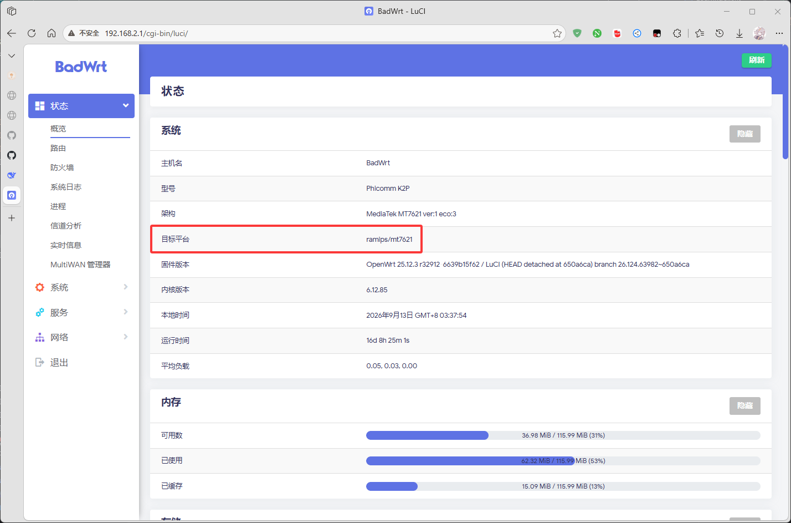

# OpenWRT 系统目标平台自查教程

> [!NOTE]
> 教程版本: v2.0.8-r2

## 必要知识

### 目标平台是什么?

### 如下图红框所示



**一个架构实际上包含多个目标平台**

**例如下载 mipsel_24kc 架构的 OpenWRT 插件安装包**

**那么它就能让以下这几个目标平台安装使用**

```text
malta/le
ramips/mt7620
ramips/mt7621
ramips/mt76x8
ramips/rt305x
```

## 架构包含的目标平台自查表

<details>
<summary>
All
</summary>

**这个是 LuCI 包专属, 表示所有目标平台都能装**

</details>

<details>
<summary>
aarch64_cortex-a53
</summary>

**aarch64_cortex-a53 架构所包含的目标平台**

```text
airoha/an7581
airoha/an7583
bcm27xx/bcm2710
bcm4908/generic
imx/cortexa53
mediatek/filogic
mediatek/mt7622
microchipsw/lan969x
mvebu/cortexa53
qualcommax/ipq807x
qualcommax/ipq60xx
qualcommax/ipq50xx
qualcommbe/ipq95xx
sunxi/cortexa53
```

</details>

<details>
<summary>
aarch64_cortex-a72
</summary>

**aarch64_cortex-a72 架构所包含的目标平台**

```text
bcm27xx/bcm2711
mvebu/cortexa72
```

</details>

<details>
<summary>
aarch64_cortex-a76
</summary>

**aarch64_cortex-a76 架构所包含的目标平台**

```text
bcm27xx/bcm2712
```

</details>

<details>
<summary>
aarch64_generic
</summary>

**aarch64_generic 架构所包含的目标平台**

```text
armsr/armv8
layerscape/armv8_64b
rockchip/armv8
```

</details>

<details>
<summary>
arm_arm1176jzf-s_vfp
</summary>

**arm_arm1176jzf-s_vfp 架构所包含的目标平台**

```text
bcm27xx/bcm2712
```

</details>

<details>
<summary>
arm_arm926ej-s
</summary>

**arm_arm926ej-s 架构所包含的目标平台**

```text
at91/sam9x
mxs/generic
sunxi/arm926ejs
```

</details>

<details>
<summary>
arm_cortex-a15_neon-vfpv4
</summary>

**arm_cortex-a15_neon-vfpv4 架构所包含的目标平台**

```text
armsr/armv7
ipq806x/generic
ipq806x/chromium
```

</details>

<details>
<summary>
arm_cortex-a5_vfpv4
</summary>

**arm_cortex-a5_vfpv4 架构所包含的目标平台**

```text
at91/sama5
```

</details>

<details>
<summary>
arm_cortex-a7
</summary>

**arm_cortex-a7 架构所包含的目标平台**

```text
mediatek/mt7629
```

</details>

<details>
<summary>
arm_cortex-a7_neon-vfpv4
</summary>

**arm_cortex-a7_neon-vfpv4 架构所包含的目标平台**

```text
bcm27xx/bcm2709
imx/cortexa7
ipq40xx/generic
ipq40xx/chromium
ipq40xx/mikrotik
layerscape/armv7
mediatek/mt7623
stm32/stm32mp1
sunxi/cortexa7
```

</details>

<details>
<summary>
arm_cortex-a7_vfpv4
</summary>

**arm_cortex-a7_vfpv4 架构所包含的目标平台**

```text
at91/sama7
```

</details>

<details>
<summary>
arm_cortex-a8_vfpv3
</summary>

**arm_cortex-a8_vfpv3 架构所包含的目标平台**

```text
omap/generic
sunxi/cortexa8
```

</details>

<details>
<summary>
arm_cortex-a9
</summary>

**arm_cortex-a9 架构所包含的目标平台**

```text
bcm53xx/generic
```

</details>

<details>
<summary>
arm_cortex-a9_neon
</summary>

**arm_cortex-a9_neon 架构所包含的目标平台**

```text
imx/cortexa9
zynq/generic
```

</details>

<details>
<summary>
arm_cortex-a9_vfpv3-d16
</summary>

**arm_cortex-a9_vfpv3-d16 架构所包含的目标平台**

```text
mvebu/cortexa9
tegra/generic
```

</details>

<details>
<summary>
arm_fa526
</summary>

**arm_fa526 架构所包含的目标平台**

```text
gemini/generic
```

</details>

<details>
<summary>
arm_xscale
</summary>

**arm_xscale 架构所包含的目标平台**

```text
kirkwood/generic
```

</details>

<details>
<summary>
armeb_xscale
</summary>

**armeb_xscale 架构所包含的目标平台**

```text
ixp4xx/generic
```

</details>

<details>
<summary>
i386_pentium-mmx
</summary>

**i386_pentium-mmx 架构所包含的目标平台**

```text
x86/legacy
x86/geode
```

</details>

<details>
<summary>
i386_pentium4
</summary>

**i386_pentium4 架构所包含的目标平台**

```text
x86/generic
```

</details>

<details>
<summary>
loongarch64_generic
</summary>

**loongarch64_generic 架构所包含的目标平台**

```text
loongarch64/generic
```

</details>

<details>
<summary>
mips64_mips64r2
</summary>

**mips64_mips64r2 架构所包含的目标平台**

```text
malta/be64
```

</details>

<details>
<summary>
mips64_octeonplus
</summary>

**mips64_octeonplus 架构所包含的目标平台**

```text
octeon/generic
```

</details>

<details>
<summary>
mips64el_mips64r2
</summary>

**mips64el_mips64r2 架构所包含的目标平台**

```text
malta/le64
```

</details>

<details>
<summary>
mips_24kc
</summary>

**mips_24kc 架构所包含的目标平台**

```text
ath79/generic
ath79/mikrotik
ath79/nand
ath79/tiny
lantiq/xrx200
lantiq/xrx200_legacy
lantiq/xway
malta/be
realtek/rtl838x
realtek/rtl839x
realtek/rtl930x
realtek/rtl930x_nand
realtek/rtl931x
realtek/rtl931x_nand
```

</details>

<details>
<summary>
mips_mips32
</summary>

**mips_mips32 架构所包含的目标平台**

```text
bmips/bcm6318
bmips/bcm6328
bmips/bcm6358
bmips/bcm6362
bmips/bcm6368
bmips/bcm63268
```

</details>

<details>
<summary>
mipsel_24kc
</summary>

**mipsel_24kc 架构所包含的目标平台**

```text
malta/le
ramips/mt7620
ramips/mt7621
ramips/mt76x8
ramips/rt305x
```

</details>

<details>
<summary>
mipsel_24kc_24kf
</summary>

**mipsel_24kc_24kf 架构所包含的目标平台**

```text
pistachio/generic
```

</details>

<details>
<summary>
mipsel_74kc
</summary>

**mipsel_74kc 架构所包含的目标平台**

```text
bcm47xx/mips74k
ramips/rt3883
```

</details>

<details>
<summary>
mipsel_mips32
</summary>

**mipsel_mips32 架构所包含的目标平台**

```text
bcm47xx/generic
bcm47xx/legacy
```

</details>

<details>
<summary>
powerpc64_e5500
</summary>

**powerpc64_e5500 架构所包含的目标平台**

```text
qoriq/generic
```

</details>

<details>
<summary>
powerpc_464fp
</summary>

**powerpc_464fp 架构所包含的目标平台**

```text
apm821xx/nand
apm821xx/sata
```

</details>

<details>
<summary>
powerpc_8548
</summary>

**powerpc_8548 架构所包含的目标平台**

```text
mpc85xx/p1010
mpc85xx/p1020
mpc85xx/p2020
```

</details>

<details>
<summary>
riscv64_generic
</summary>

**riscv64_generic 架构所包含的目标平台**

```text
d1/generic
sifiveu/generic
siflower/sf21
starfive/generic
```

</details>

<details>
<summary>
x86_64
</summary>

**x86_64 架构所包含的目标平台**

```text
x86/64
```

> [!NOTE]
> 这 x86_64 肯定是只包含 x86/64 的呐~

</details>
